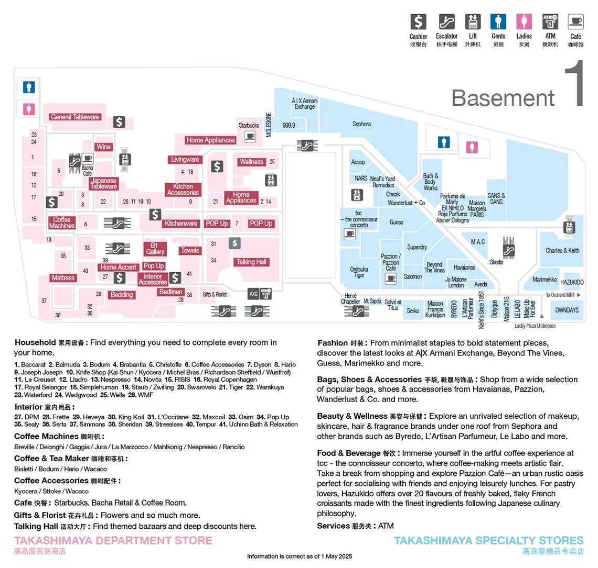
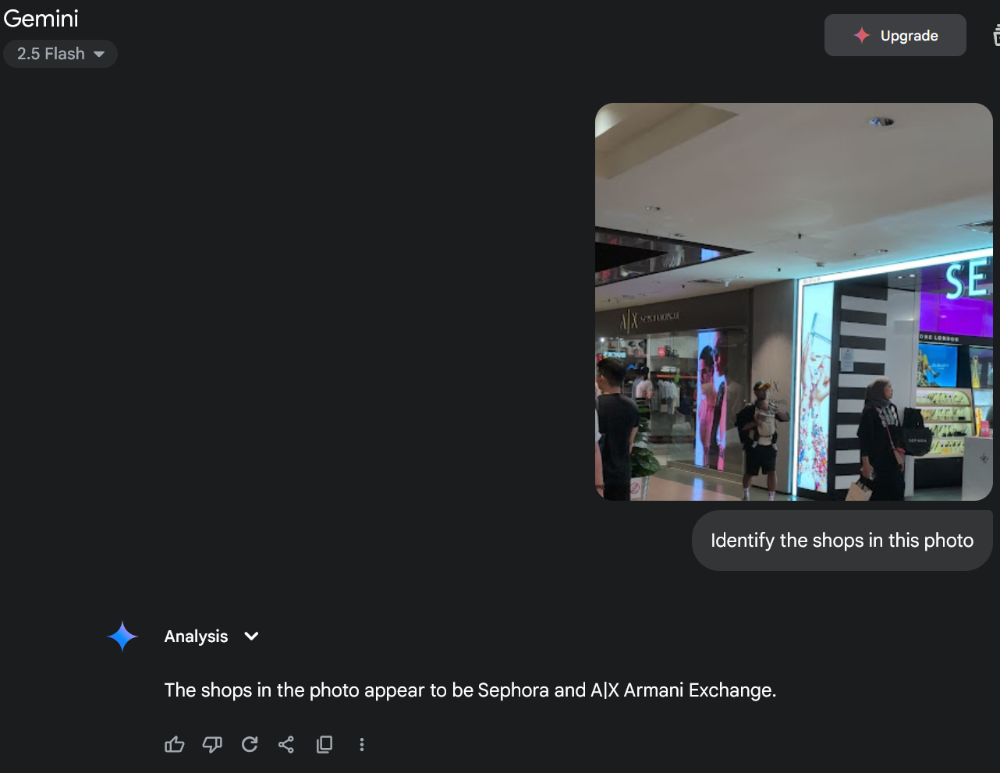
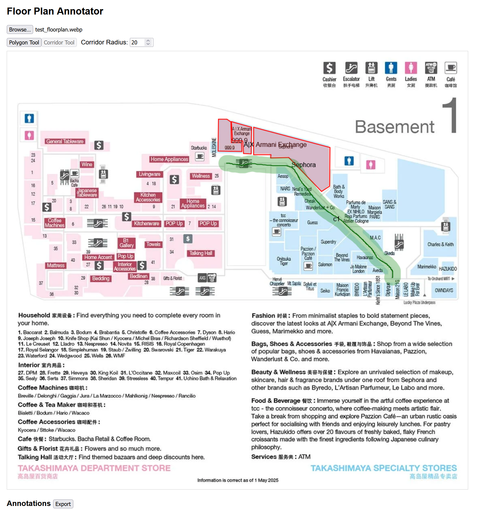
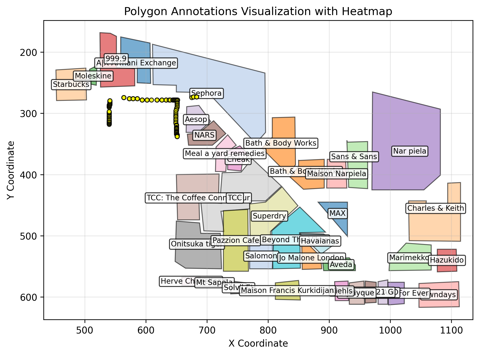
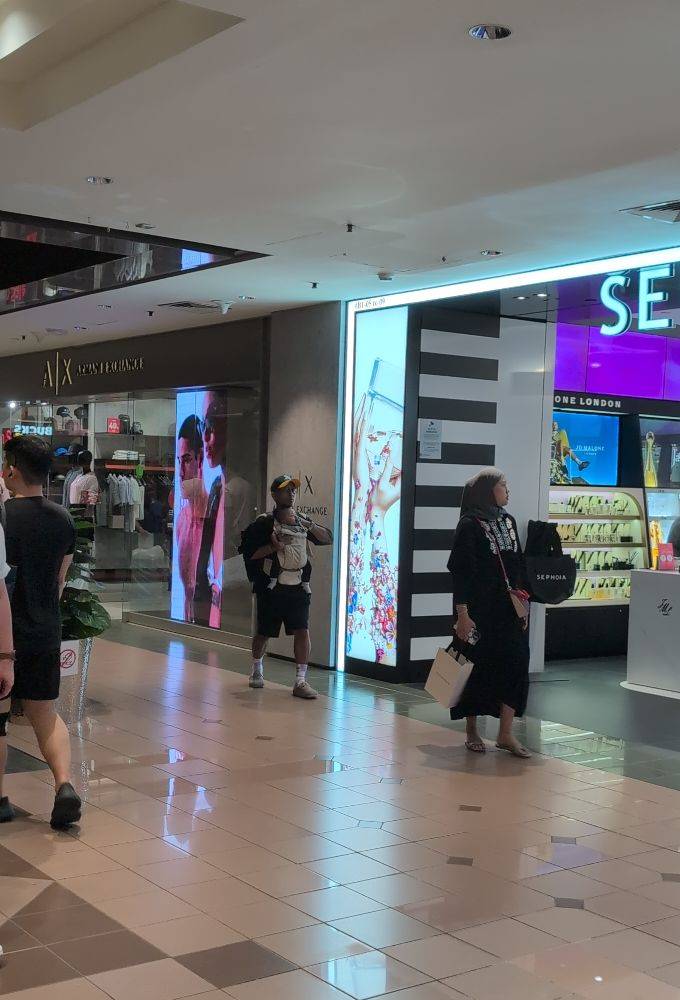

# Indoor Localization in An Era of Software 3.0

> **Disclaimer:**  
> This project was completed entirely on personal time and hardware. It is not 
> affiliated with, endorsed by, or representative of any institutions
> or organizations with which I am affiliated. The views and opinions expressed herein 
> are solely my own and do not represent those of my employer or any associated institutions.

LLMs and VLMs have been eating the world. Last week, I listened to a talk by Andrej Karpathy on his view of "Software 3.0." Unlike the two extreme perspectives I'm usually surrounded by, Andrej’s talk was refreshingly optimistic—without ignoring the pitfalls of LLMs.

It took me back to 2014, when I took on my first paid gig. I was still in high school and had recently released a small Arduino library that classified phonemes. Amid recruiter emails and general noise, I somehow ended up doing freelance work before I was called up for national service.

My first client wanted an "indoor location system" using BLE beacons. I charged a measly $500—not realizing I probably could have added two zeros if I had even a shred of business sense. The system was simple: a user would carry a Bluetooth tag, and the server would read the BLE signal and run a basic decision tree classifier to guess which room the tag was in. The dashboard was written in PHP, and we used XMPP as the communication protocol between the IoT sensors (PCDuinos, if I remember correctly).

This idea kind of followed me around. In undergrad, I built a simple app that used AR to show directions within our School of Computing. It was far from a working solution—we didn’t have an accurate map to align things with—but it planted a seed.

Fast forward to 2025. I’m now married and found myself shopping for gifts. While my wife was browsing in a large shopping mall in Singapore, I was bored in a corner and decided to see if I could "vibe-code" something on my phone. I was especially curious: could we use today’s VLM-based technologies to do indoor localization in a mall?

## VLMs and reading maps

Generally if a user looks at a map in a shopping mall, he or she is greeted with something like this:



This floorplan is sufficient for humans to navigate. So what about machines? Is there a way for them to use VLMs 
for localization purposes. Lets start simply: What features are on these maps? Well, there are markings for corridors,
shops and toilets. For simplicity's sake lets start with shops:



This got my head spinning. Maybe we could simply code out a localization system that uses semantic maps for
figuring out where a user is within a building. So I got prototyping over the weekend. I vibed out an annotation tool
and a tool for parsing the annotated files. The annotation tool is available [here](editor/corridor_annotation.html).
It looks something like this:



It was amazing that I could do this in two prompts. In general I've found vibe coding to be great for building such one-of tools. After that we post-process the annotations. For each point on the corridor we determine which shops will be visible based on which direction a user is facing.

```python
def preprocess_visible_shops(annotations, grid, grid_info, radius=50):
    """
    Go through all the corridor points and find visible shops.
    """
    visible_shops = {}
    explored = set()
    for annotation in annotations:
        if annotation.get('type') != 'corridor':
            continue
        
        points = annotation.get('points', [])
        if not points:
            continue
        
        for point in points:
            cx = int(point['x'])
            cy = int(point['y'])
            if (cx, cy) in explored:
                continue
            explored.add((cx, cy))
            # Sample visible shops in all directions
            for dir in range(0, 360, 30):  # Sample every 30 degrees
                shops = sample_grid_visible_shops(grid, grid_info, cx, cy, dir, fov=50, radius=radius)
                if shops in visible_shops:
                    visible_shops[shops].append((cx, cy, dir))
                else:
                    visible_shops[shops] = [(cx, cy, dir)]
    
    return visible_shops
```
We save the individual poses and the visible shops to a pickle file.
Next we write a small API to query the shops in the image.

```python
def detect_shops_in_image(image_path):
    if not os.environ.get("GOOGLE_API_KEY"):
        raise ValueError("GOOGLE_API_KEY environment variable is not set.")

    with open(image_path, 'rb') as f:
        image_contents = f.read()

    image_part = {
        "mime_type": "image/jpeg",
        "data": image_contents
    }

    # Call Gemini API to detect shops
    gemini_result = call_gemini(image_part)

    # Convert the result to a list of shop names
    return sorted([normalize_shop_name(item["shop_name"]) for item in gemini_result])
```
We can now use our pickled list of shops to match against our pickle file.


For reference the image I used was:


This was honestly incredible. Going from a single photo to reasonably accurate map coordinates was genuinely surprising. Despite some ambiguity, the locations marked were correct—I was indeed standing among the yellow circles! It’s amazing that we can localize against an imprecise map using just a bit of prompting and glue code.

Some of the ambiguity likely stems from the fact that we’re only using text-based prompting, rather than feeding both the image and the map directly into the VLM.

Admittedly, this example is somewhat cherry-picked—the photo I used had clearly visible shop signs. Still, it strongly suggests that VLMs can be useful for localization tasks. With video input and additional phone sensor data—perhaps paired with a particle filter—we might be able to further refine the estimate. Alternatively, we could go the "benchmark dataset" route, training a model to map photos to rough map positions more robustly.

I genuinely believe there’s real potential here, especially with the upcoming wave of AR devices. There may also be applications in robotics, though it’s worth noting that there’s a long road from this proof-of-concept to a reliable, production-ready system.

For now, this is just a fun experiment—so take it as exactly that.

The tools for doing this are all available in this repo: